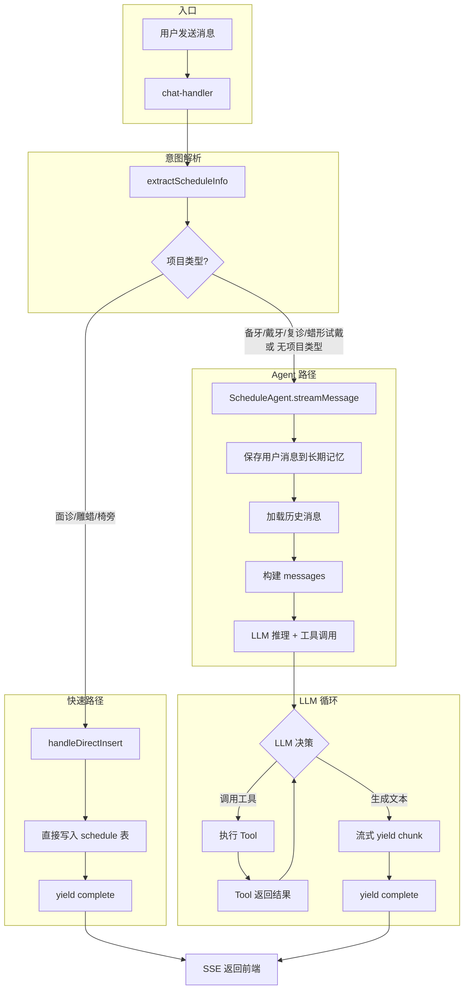
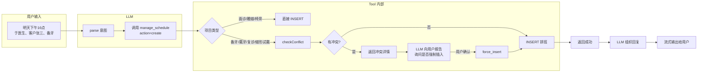
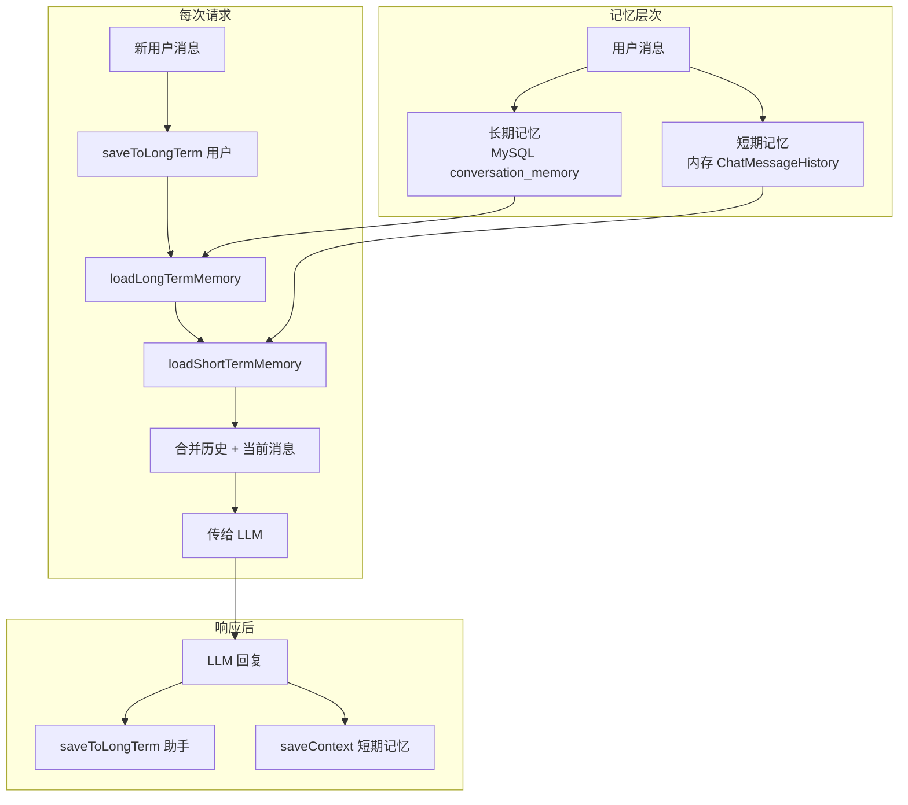

# AI 排班助手 (AI Schedule Agent)

基于 LangChain + 大语言模型（DeepSeek/OpenAI）的智能排班 Agent，通过自然语言实现排班查询、创建、修改、VIP 优先插入等操作。

---

## 一、功能概览

| 功能 | 说明 |
|------|------|
| 查询排班 | 按日期、医生查询排班记录 |
| 创建排班 | 自然语言创建排班，自动冲突检测、资源分配 |
| 修改排班 | 更新已有排班的客户、医生、时间等 |
| VIP 优先 | 支持 VIP 插队，自动顺延受影响排班 |
| 闲聊 | 非排班对话直接友好回复 |

---

## 二、整体架构

```
┌─────────────────────────────────────────────────────────────────────┐
│                         HTTP API (SSE 流式)                           │
│  POST /api/ai-schedule/chat  │  GET /history  │  POST /confirm        │
└─────────────────────────────────────────────────────────────────────┘
                                      │
                                      ▼
┌─────────────────────────────────────────────────────────────────────┐
│                    Chat Handler (chat-handler.js)                     │
│  • extractScheduleInfo 解析用户意图                                    │
│  • 快速路径：面诊/雕蜡/椅旁 → 直接插入，不走 LLM                         │
│  • 完整路径：备牙/戴牙等 → 走 Agent 流程                                │
└─────────────────────────────────────────────────────────────────────┘
                                      │
                                      ▼
┌─────────────────────────────────────────────────────────────────────┐
│                     ScheduleAgent (agent/index.js)                     │
│  • 加载记忆（短期 + 长期）                                              │
│  • 构建消息 → LLM 推理 → 工具调用 → 流式输出                             │
└─────────────────────────────────────────────────────────────────────┘
                                      │
            ┌─────────────────────────┼─────────────────────────┐
            ▼                         ▼                         ▼
┌───────────────────┐   ┌───────────────────┐   ┌───────────────────┐
│   manage_schedule  │   │    query_user      │   │ query_available_  │
│   (统一排班工具)    │   │  (查询医生/护士)   │   │   resources       │
│ query/create/      │   │                    │   │   (可用诊室)       │
│ update/force_*     │   │                    │   │                    │
└───────────────────┘   └───────────────────┘   └───────────────────┘
            │
            ▼
┌───────────────────┐   ┌───────────────────┐   ┌───────────────────┐
│ conflict-checker   │   │ resource-allocator │   │ vip-priority-     │
│ (冲突检测)         │   │ (诊室分配)         │   │ handler (顺延)    │
└───────────────────┘   └───────────────────┘   └───────────────────┘
```

---

## 三、AI 流程图

### 3.1 主流程



### 3.2 创建排班流程（manage_schedule action=create）



### 3.3 记忆与上下文



---

## 四、核心实现

### 4.1 目录结构

```
ai-schedule/
├── agent/               # Agent 核心
│   ├── config.js        # LLM 配置（DeepSeek/OpenAI）
│   ├── deepseek-adapter.js  # DeepSeek API 适配器
│   ├── index.js         # ScheduleAgent 类
│   └── prompt.js        # 系统提示词
├── handlers/            # 请求处理
│   ├── chat-handler.js  # 聊天入口、直接插入、确认
│   └── session-handler.js  # 历史、删除会话
├── memory/              # 记忆管理
│   ├── manager.js       # 短期/长期记忆协调
│   ├── short-term.js    # 内存短期记忆
│   └── long-term.js     # MySQL 长期存储
├── parsers/             # 解析器
│   ├── info-extractor.js  # 从文本提取排班信息
│   └── time-parser.js   # 时间表达式解析
├── tools/               # 工具
│   ├── schedule-tools-optimized.js  # manage_schedule 等
│   ├── resource-tools.js   # 可用资源查询
│   └── index.js
├── utils/               # 工具函数
│   ├── conflict-checker.js   # 冲突检测
│   ├── project-type-checker.js  # 项目类型判断
│   ├── resource-allocator.js   # 诊室分配
│   └── vip-priority-handler.js  # VIP 顺延
├── config.js
└── README.md
```

### 4.2 关键组件

| 组件 | 作用 |
|------|------|
| **extractScheduleInfo** | 正则 + 关键词从自然语言提取：项目、医生、护士、客户、时间、诊室、VIP |
| **manage_schedule** | 统一工具，支持 query/create/update/force_insert/force_update |
| **checkConflict** | 检测医生、诊室时间重叠，支持 exclude_schedule_id（修改时排除自身） |
| **needsConflictCheck** | 备牙/戴牙/复诊/蜡形试戴 需冲突检测；面诊/雕蜡/椅旁 跳过 |
| **MemoryManager** | 短期记忆（进程内）+ 长期记忆（MySQL），按 session 隔离 |

### 4.3 项目类型与冲突

```javascript
// config.js
noConflictCheck: ['面诊', '雕蜡', '椅旁', '休息']
withConflictCheck: ['备牙', '戴牙', '复诊', '蜡形试戴']
```

- **无冲突**：直接写入，不查重叠
- **有冲突**：创建/修改时检测医生、诊室时间；冲突则返回详情，由 LLM 询问用户是否强制插入

---

## 五、API 说明

| 接口 | 方法 | 说明 |
|------|------|------|
| `/api/ai-schedule/chat` | POST | 聊天（SSE 流式），body: `{ session_id, message, user_id }` |
| `/api/ai-schedule/history/:session_id` | GET | 获取会话历史 |
| `/api/ai-schedule/session/:session_id` | DELETE | 删除会话 |
| `/api/ai-schedule/confirm` | POST | 确认排班（冲突后用户确认插入） |
| `/api/ai-schedule/vip-insert` | POST | VIP 优先插入 |

---

## 六、环境变量

```env
DEEPSEEK_API_KEY=xxx        # 使用 DeepSeek 时
OPENAI_API_KEY=xxx         # 使用 OpenAI 时
AI_MODEL_TYPE=deepseek     # deepseek | openai
```

---

## 七、初学者阅读顺序

1. **chat-handler.js**：入口逻辑，理解快速路径 vs Agent 路径
2. **agent/index.js**：Agent 如何加载记忆、调用 LLM、流转式输出
3. **agent/prompt.js**：系统提示词，理解 LLM 被要求如何决策
4. **tools/schedule-tools-optimized.js**：manage_schedule 各 action 实现
5. **utils/conflict-checker.js**：冲突检测 SQL 逻辑
6. **parsers/info-extractor.js**：如何从自然语言提取结构化信息
